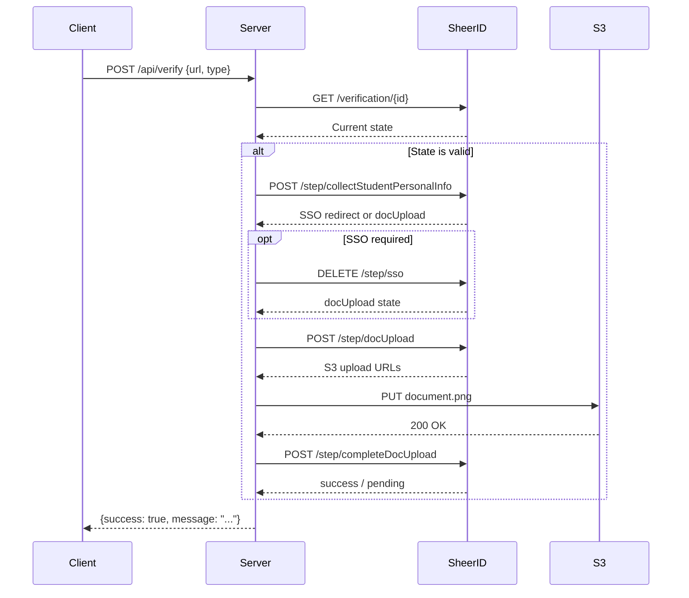

<div align="center">

# 🤖 Auto Verify Tool

[](https://nodejs.org/)
[](https://expressjs.com/)
[](https://pptr.dev/)
[](https://www.sheerid.com/)

**An automated verification engine that interfaces with SheerID's REST API to streamline student/teacher discount verification.**

</div>

---

## 📖 Overview

The **Auto Verify Tool** is a Node.js backend service that automates the SheerID verification process. It generates realistic student/teacher identities, creates document proofs (student cards, payslips), and submits verification requests via SheerID's API.

> [!CAUTION]
> **For Educational Purposes Only** - This tool demonstrates how identity verification APIs work. Misuse may violate Terms of Service.

---

## 🏗️ Architecture

```
┌─────────────────────────────────────────────────────────────────┐
│                         Frontend (index.html)                   │
│                    User enters verification URL                 │
└────────────────────────────┬────────────────────────────────────┘
                             │ POST /api/verify
                             ▼
┌─────────────────────────────────────────────────────────────────┐
│                        Express Server                           │
│                         (server.js)                             │
│  ┌──────────────────────────────────────────────────────────┐   │
│  │  • Session Management                                     │   │
│  │  • SSE Real-time Logs (/api/logs)                        │   │
│  │  • Request Routing                                        │   │
│  └──────────────────────────────────────────────────────────┘   │
└────────────────────────────┬────────────────────────────────────┘
                             │
                             ▼
┌─────────────────────────────────────────────────────────────────┐
│                      Verification Engine                        │
│                        (verifier.js)                            │
│  ┌─────────────────┐  ┌─────────────────┐  ┌─────────────────┐  │
│  │  Link Validator │  │ Identity Gen    │  │ Document Gen    │  │
│  │  • Check state  │  │ • Faker.js      │  │ • Puppeteer     │  │
│  │  • Handle SSO   │  │ • Weighted uni  │  │ • PDF/PNG       │  │
│  └─────────────────┘  └─────────────────┘  └─────────────────┘  │
│                             │                                    │
│                             ▼                                    │
│  ┌──────────────────────────────────────────────────────────┐   │
│  │               SheerID REST API v2                         │   │
│  │  • POST /verification/{id}/step/collectStudentPersonalInfo│   │
│  │  • DELETE /verification/{id}/step/sso                     │   │
│  │  • POST /verification/{id}/step/docUpload                 │   │
│  │  • POST /verification/{id}/step/completeDocUpload         │   │
│  └──────────────────────────────────────────────────────────┘   │
└─────────────────────────────────────────────────────────────────┘
```

---

## ⚙️ How It Works

### 1️⃣ Link State Validation

Before processing, the tool checks if the verification link is in a valid state:

```javascript
const VALID_START_STATES = [
    'collectStudentPersonalInfo',
    'collectTeacherPersonalInfo',
    'initial'
];
```

| State | Meaning |
|-------|---------|
| `collectStudentPersonalInfo` | ✅ Ready for student verification |
| `collectTeacherPersonalInfo` | ✅ Ready for teacher verification |
| `sso` | ⚠️ SSO required (auto-skipped) |
| `docUpload` | ⏭️ Already submitted info, needs doc |
| `success` | ✅ Already verified |
| `error` | ❌ Verification failed |

### 2️⃣ Identity Generation

The tool uses **Faker.js** to generate realistic identities:

```javascript
{
  firstName: "Thanh",           // Random first name
  lastName: "Nguyxn",           // Random last name
  email: "thanhng@mit.edu",    // University domain email
  birthDate: "2007-07-17",       // Age 18-25 for students
  studentId: "77777777"           // Random 8-digit ID
}
```

### 3️⃣ University Selection (Weighted)

Universities are selected based on **success rate tracking**:

```javascript
// Priority order:
1. USA universities (typically higher success rate)
2. Universities with no stats yet (tested first)
3. Universities with highest historical success rate
4. Random selection from top 5 performers
```

**Supported Regions:**
- 🇺🇸 USA (14 universities including MIT, Harvard, Stanford, etc.)
- 🇬🇧 UK (Oxford, Cambridge, Imperial)
- 🇨🇦 Canada (Toronto, McGill, UBC)
- 🇯🇵 Japan (Tokyo, Kyoto)
- 🇰🇷 South Korea (SNU, Yonsei, Korea)
- 🇩🇪 Germany (TUM, LMU)
- 🇫🇷 France (Polytechnhique, PSL)
- 🇸🇬 Singapore (NUS, NTU)
- 🇨🇳 China (Tsinghua, Peking, Fudan)
- 🇧🇷 Brazil (USP, Unicamp, UFRJ)
- 🇦🇺 Australia (Melbourne, ANU, Sydney)
- 🇻🇳 Vietnam (HUST, FPT, PTIT, etc.)
- 🇮🇳 India (IIT Delhi, Mumbai)

### 4️⃣ Document Generation

The tool uses **Puppeteer** to capture screenshots from:

| Document Type | Generator Tool | Format |
|---------------|----------------|--------|
| Student ID Card | [student-card-generator](https://thanhnguyxn.github.io/student-card-generator/) | PNG |
| Payslip | [payslip-generator](https://thanhnguyxn.github.io/payslip-generator/) | PNG/PDF |
| Teacher Card | payslip-generator | PNG |

### 5️⃣ SheerID API Flow



### 6️⃣ Reward Code Polling

After successful document upload, the tool polls SheerID for the reward code:

```javascript
// Poll every 2 seconds, max 10 attempts
async function pollForRewardCode(verificationId, maxAttempts = 10) {
    for (let i = 0; i < maxAttempts; i++) {
        await sleep(2000);
        const response = await axios.get(`/verification/${verificationId}`);
        
        if (response.data.rewardCode) return response.data.rewardCode;
        if (response.data.currentStep === 'error') return null;
    }
}
```

| Step | Description |
|------|-------------|
| `success` | ✅ Reward code available immediately |
| `pending` | ⏳ Manual review needed (check email) |
| `error` | ❌ Verification rejected |

---

## 🚀 Installation

### Prerequisites

- Node.js 18+ 
- npm or yarn
- Chrome/Chromium (for Puppeteer)

### Setup

```bash
# Clone the repo
git clone https://github.com/ThanhNguyxn/SheerID-Verification-Tool.git
cd SheerID-Verification-Tool/auto-verify-tool

# Install dependencies
npm install

# Start the server
npm start
```

### Configuration

Edit `config.json` to customize:

```json
{
  "port": 3000,
  "preferUSA": true,
  "maxRetries": 3,
  "minDelay": 300,
  "maxDelay": 800
}
```

---

## 📡 API Endpoints

### `POST /api/verify`

Initiate a verification request.

**Request Body:**
```json
{
  "url": "https://services.sheerid.com/verify/abc123?verificationId=xxx",
  "type": "spotify",
  "sessionId": "session_1234567890_abc"
}
```

**Supported Types:**
| Type | Description | Document Used |
|------|-------------|---------------|
| `spotify` | Spotify Premium Student | Student Card (PNG) |
| `youtube` | YouTube Premium Student | Student Card (PNG) |
| `gemini` | Google Gemini Student | Student Card (PNG) |
| `teacher` | Bolt.new Teacher | Payslip (PNG) |
| `gpt` | ChatGPT K-12 Teacher | Payslip (PDF) + Teacher Card (PNG) |

**Response:**
```json
{
  "success": true,
  "message": "Verification successful!",
  "rewardCode": "CODE-123-ABC"  // Optional
}
```

### `GET /api/logs?sessionId={id}`

Server-Sent Events (SSE) endpoint for real-time logs.

```javascript
// Example usage
const eventSource = new EventSource('/api/logs?sessionId=xxx');
eventSource.onmessage = (event) => {
  const log = JSON.parse(event.data);
  console.log(log.message);
};
```

---

## 🛡️ Anti-Detection Features

| Feature | Implementation |
|---------|----------------|
| **Realistic Fingerprints** | MD5 hash of platform + random components |
| **Request Delays** | Random 300-800ms between API calls |
| **Exponential Backoff** | 1s → 2s → 4s on failed requests |
| **Age-Appropriate Dates** | Birth dates generate ages 18-25 |
| **University Rotation** | Weighted selection based on success rates |
| **Session Isolation** | Unique session IDs prevent log mixing |

---

## 📂 File Structure

```
auto-verify-tool/
├── server.js              # Express server + SSE handling
├── verifier.js            # Core verification logic
├── generator.js           # Puppeteer document generation
├── universities-data.js   # University + K12 school database
├── university-ids.json    # SheerID organization IDs
├── config.json            # Configuration options
├── package.json           # Dependencies
└── README.md              # You are here! 👋
```

---

## 🔧 Improvement Ideas

- [ ] Add AsyncLocalStorage for truly isolated session logs
- [ ] Implement captcha solving integration
- [ ] Add proxy rotation support
- [ ] Create a verification queue system
- [ ] Add webhook callbacks for async notifications
- [ ] Implement rate limiting per IP

---

## 🎓 K12 Teacher Verification Tips

> [!TIP]
> **Manual Verification Guide** - If auto-verification fails, try these manual steps for ChatGPT K12 Teacher verification.

### 📋 Step-by-Step Manual Process

| Step | Action | Details |
|------|--------|---------|
| 1️⃣ | **Prepare IP Environment** | Use residential/business IP, avoid datacenter IPs |
| 2️⃣ | **Find Target School** | Search on [US News High School Rankings](https://www.usnews.com/education/best-high-schools/search?name=) |
| 3️⃣ | **Search Teacher Info** | Google: `[School Name] TEACHER` to find real names/emails |
| 4️⃣ | **Verify K12 Type** | Use DevTools (F12) to check `orgsearch.sheerid.net` returns `K12` type |
| 5️⃣ | **Submit Info** | Use real teacher info from Google search |

### 🔍 Useful Teacher Directory Links

```
https://www.bxscience.edu/apps/staff/
https://www.lincolnhs.org/apps/staff/departmental.jsp
https://lincoln.tacomaschools.org/contact
```

### ⚡ K12 vs HIGH_SCHOOL

When searching for schools in SheerID, make sure the organization type is **K12**, not `HIGH_SCHOOL`:

```javascript
// ✅ Correct - K12 type
{ "type": "K12", "name": "Lincoln High School" }

// ❌ Wrong - HIGH_SCHOOL type (won't work for ChatGPT)
{ "type": "HIGH_SCHOOL", "name": "Lincoln High School" }
```

### 🛠️ If Document Upload Required

| Situation | Cause | Solution |
|-----------|-------|----------|
| Doc upload requested | School has many verifications | Upload solid color image 3x, then resubmit |
| Persistent failures | Bad IP environment | Switch to cleaner IP/VPN |
| Instant success | Good IP + unused school | No document needed! 🎉 |

> [!NOTE]
> **Pro Tip**: K12 verification often doesn't require document upload if the IP environment is clean and the school hasn't been overused.

### 📚 K12 Teachers Data (`teachers.js`)

**Usage:**
```javascript
// Pick random teacher from teachers.js
const teacher = getRandomTeacher("156251");
// { fullName: "Rachel Hoyle", email: "rhoyle@schools.nyc.gov", position: "Principal" }
```

**Manual Workflow:**
1. Open `teachers.js` → Pick a teacher
2. Fill SheerID form with: First Name, Last Name, Email
3. Select matching school from dropdown
4. If doc needed → Use payslip-generator with same info

---

## ⚠️ Error Handling

| Error Type | Cause | Solution |
|------------|-------|----------|
| `invalidStep` | Link not in valid state | Get a new verification link |
| `organization_not_found` | University not in SheerID DB | Try different university |
| `expiredLink` | Link has expired | Get a new link from service |
| `rateLimited` | Too many requests | Wait 1-2 minutes |
| `ssoRequired` | SSO verification needed | Auto-handled by tool |

---

## 📊 Success Rate Tracking

The tool tracks verification success rates per university:

```javascript
verificationStats = {
  total: 150,
  success: 123,
  failed: 27,
  byUniversity: {
    "Pennsylvania State University": { total: 50, success: 45 },
    "MIT": { total: 30, success: 28 },
    // ...
  },
  getSuccessRate() // Returns "82.0%"
}
```

---

## 📜 License

This project is licensed under the MIT License - see the [LICENSE](../LICENSE) file for details.

---

<div align="center">

**Made with ❤️ by ThanhNguyxn**

If you found this helpful, consider giving a ⭐ on [GitHub](https://github.com/ThanhNguyxn/SheerID-Verification-Tool)!

</div>
